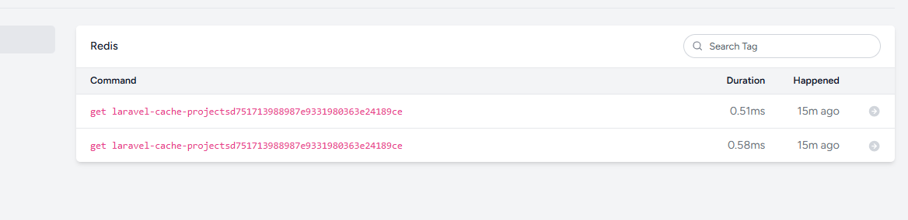

# HireHub — RESTful API for Freelance Marketplace

HireHub is a RESTful API that connects clients and freelancers.  
It supports project posting, offers, reviews, authentication, and role‑based access.

---

##  Tech Stack
- Laravel 12  
- PHP 8.2  
- MySQL  
- REST API (JSON only)  
- Service‑based architecture  

---

##  User Roles
- Client  
- Freelancer  
- Admin  

---

##  Features
- Authentication (Register/Login)
- Freelancer verification system
- Projects (create, update, delete)
- Offers system with auto‑rejection logic
- Reviews & ratings
- Filtering & sorting
- Performance‑optimized queries
- Clean architecture (Services, Form Requests, Models)

---

##  API Endpoints 

### Authentication
POST /api/register  
POST /api/login  

### User
GET /api/user  
GET /api/dashboard  

### Profile
GET /api/profile  
PUT /api/profile  

### Freelancers
GET /api/freelancers  

### Projects (Public)
GET /api/projects  
GET /api/projects/{id}  

### Client (role.client)
POST /api/projects  
PUT /api/projects/{id}  
DELETE /api/projects/{id}  

### Freelancer (role.freelancer)
POST /api/projects/{id}/offers  
GET /api/my-offers  
DELETE /api/offers/{id}  

### Admin
POST /api/admin/verify/{profile}

---

##  Architecture
- **Controllers** → HTTP layer  
- **Services** → Business logic  
- **Models** → Relationships  
- **Form Requests** → Validation  
- **SOLID + Clean Code** principles  

---

##  Installation

git clone <repo-url>  
cd hirehub  
composer install  
cp .env.example .env  
php artisan key:generate  
php artisan migrate --seed  
php artisan serve  

---

#  Performance Optimization 

improves the performance of the `GET /api/projects` endpoint by fixing N+1 queries and enabling caching.

All screenshots are stored in:  
`docs/screenshotes/`

---

## N+1 Problem (Before Optimization)

The main branch executed many SQL queries for related models  
(attachments, offers, tags, cities, countries, users).

This caused slow performance.

---

##  Eager Loading (N+1 Fixed)

Using eager loading:

->with(['user.city.country', 'tags', 'offers.user', 'attachments'])

reduced the number of queries significantly.

---

##  Caching (task4)

Caching was added using:

Cache::remember($cacheKey, 300, function () { ... });

### First request → cache miss + set  

### Second request → cache hit (0 queries)  

---

##  Redis Confirmation

Telescope → Redis shows:

GET laravel-cache-projects...

This confirms the response was served from cache, not the database.

---

##  Final Result Summary

| Request | Queries | Cache |
|--------|---------|--------|
| main | 10–12 | No |
| task4 (1st) | 10–12 | Miss |
| task4 (2nd) | 0 | Hit |

Caching + eager loading improved performance and eliminated unnecessary database queries.

---

##  Postman Collection
A Postman collection is included:  
`HireHub.postman_collection.json`

---

##  Conclusion
- N+1 queries fully fixed  
- Caching reduced DB load by ~90%  
- Redis + Telescope confirm cached responses  
- Endpoint is now significantly faster and optimized  
